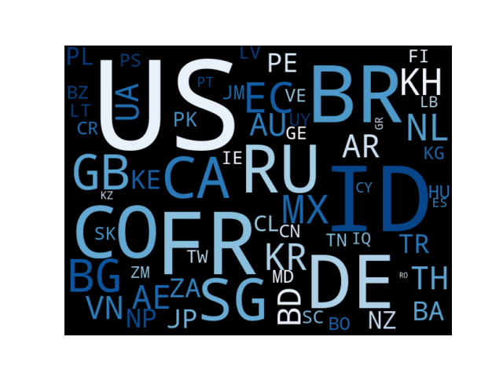
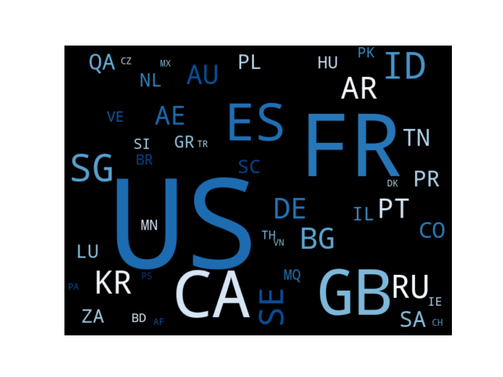

# Big Data Analytics

Authors: Eric Beier, Friederike Marby and Paula Möller <br>
Date: 2023-02-09

## Description
This project is part of the module Big Data Analytics at HTW Berlin - Master Wirtschaftsinformatik.

#### Source Code <br>
* Clean Code
* Code conventions
* KISS/YAGNI
* runnable on every machine/ possible to deploy in a cloud environment - Tip: AWS Lambda!

#### Rough overview of the technologies used
* architecture diagram (draw.io) > https://aws.amazon.com/de/architecture/icons/
* Readme/ HowTo (*.md) > https://www.makeareadme.com

#### GitLab
A clean way of working in GitLab. Plan your work, use the function to estimate the amount of work and time invested.

#### Project tasks
##### A3.1 -  Data preparation & standardization
Please bring all files into a uniform structure. For the use of a NoSQL database there are extra points.

##### A3.2 - How big is the difference in the list / What % of IPs change per day?
only changing the IPs is enough (sometimes the port changes or other things).

##### A3.3 - 5 days current data from the Feodotracker
https://feodotracker.abuse.ch/downloads/ipblocklist_recommended.json
extra points for an automation script.

##### A3.4 - What is the difference in the IP lists from January 2022 to the current ones? / What % of IPs change per day in the current files?
only changing the IPs is enough (sometimes the port changes or other things)

##### A3.5 - Visual Report for A3.4
Here you have a free hand and can let off steam: Bar charts, time series or a map, etc. is fine here. Explain briefly why you have used this type of visualization.

##### A3.6 Create a wordcloud
Please create two word clouds with the country codes where most of the C&Cs can be found. 1x for January 2022 and once a current representation.

## Archicture diagram and used technologies
*Architecture diagram*

#### Used technologies
* AWS DynamoDB
* AWS Lambda
* Local Python scripts

## How to execute & run

Before you can execute and run our code you need to install Python and the following library.

* Boto3
```
pip install boto3
```

In this project we used AWS Lambda as an event-driven, serverless computing platform provided by Amazon as part of Amazon Web Services. Therefore we defined and used the following Lambda functions.

**Lambda Functions**
* AutomatedQueryFeodoDaily - https://oxc77jgxqgt4pv77ojwz22icbq0hcpsx.lambda-url.eu-central-1.on.aws/
* dataExportDynamoDB - https://j6a7cppundv7t2fsdwke3tpkiu0qwyoo.lambda-url.eu-central-1.on.aws/

Our code is runnable on every machine (Win, Linux, Mac).

## Results and visualizations
**Task 3.2** 
To look at the differences in the IP lists in January, 3 plots were made. One that shows the number of IP addresses for each day and the previous day for comparison. 
It can be seen that the number of IP addresses is always in the range of 300. A horizontal bar chart was chosen because it clearly shows both the data and the differences in the number. 
The scaling was chosen so that this diagram can be compared with the later diagram of the December data.


The second plot shows the number of new IP addresses over days. Again a bar chart was chosen. This representation makes it possible to quickly see the differences between the days.
Furthermore, this is not a time series where the previous day's data plays a role in the current day's data. Therefore, a line chart would possibly be confusing, as these are often 
used for time series data where the days have an influence on each other. The labels of the X-axis were rotated so that they are easier to read and do not overlap each other. 
The scaling was chosen so that this diagram can be compared with the later diagram of the December data.


The third plot represents the percentage changes in the new IP addresses. Once again, the bar chart is the best choice. Although these are percentage values, but they stand for themselves 
and cannot be shown in a pie chart. The scaling was chosen so that this diagram can be compared with the later diagram of the December data.


**Task 3.4**

The first part and thus the first 3 plots were chosen for the same reasons as task 3.2. This makes a direct comparison possible. Furthermore, 2 diagrams were made comparing the average 
values of the January dataset and the December dataset. Bar charts were also chosen here, as the differences between the individual data sets can be differences between the individual 
data sets. 

  

The following plots show the differences between the January and December data. Here you can see the number(left) of new IPs per day and in percent(right). The scale shows the number 
as well as the IPs in percent, as both are in the range of 3-30 or 3%-30%. 


The last plot shows the numbers of all IP addresses. Here, too, a bar chart made the most sense, as it is the only way to get a clear overview of all three key figures. 


**Task 3.6 Wordcloud**
Two word clouds visualize in with countries most of the C&Cs can be found. To demonstrate the countries the different country codes are used

January:



December:


